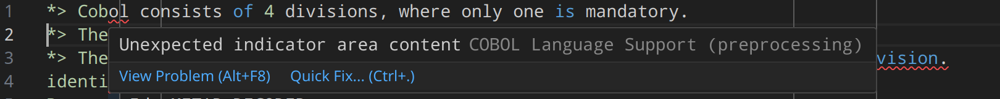
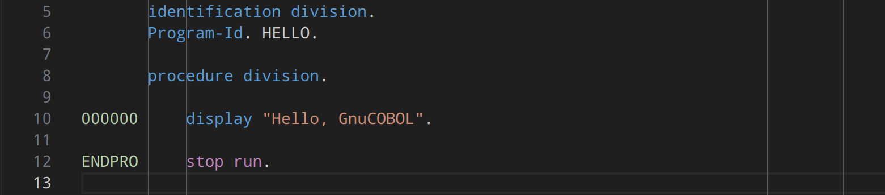
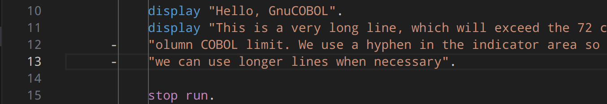
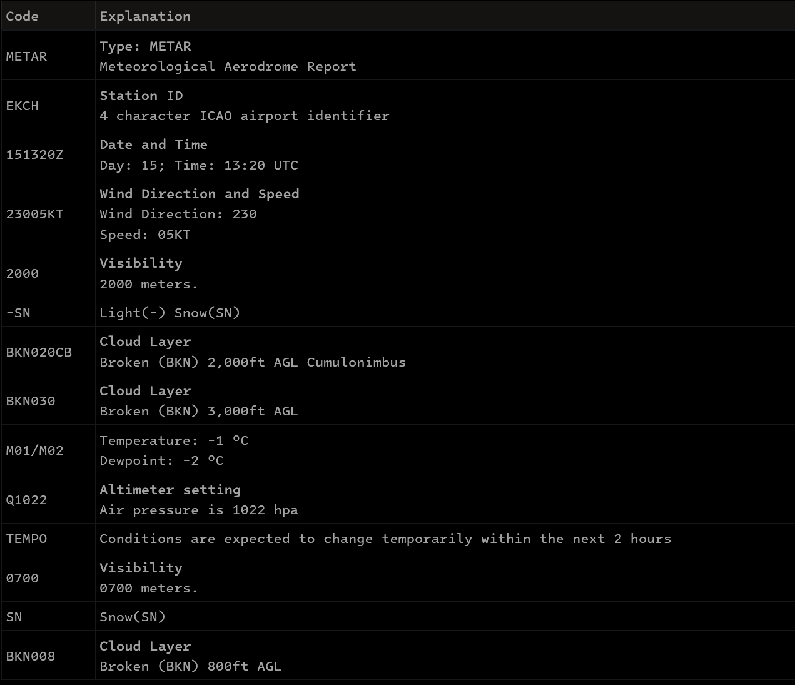
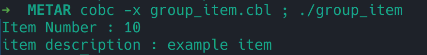
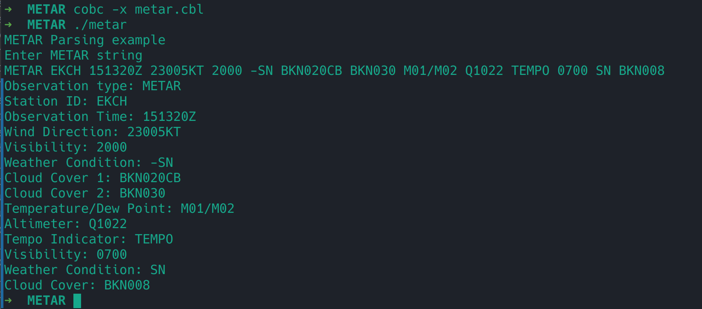

# Learning some COBOL and writing a METAR decoder
After installing GnuCOBOL, see [notes](notes.md), we want to just write some simple COBOL and get started. 

I installed the `COBOL Language Support` extension in VS Code.

The simplest program I could think of is of course Hello World. So lets write that.

From a quick online read I knew that COBOL consists of 4 divisions, where only one is mandatory. The mandatory division is the Identification Division. The other three are the Environment Division, Data Division and Procedure Division.

For people familiar with assembly language, this is not unlike sections in assembly such as .data and .text. Essentially
it splits the program into data and instructions. COBOL wants you to tell it what you are (program-ID), declare your variables you intend to use, files you intend to open, etc. prior to the actual program logic. This is actually a pretty good idea I think, since you can learn a lot about what a program does simply by reading the top of the program. What the program is named, which files are being read / written, and what variables are named gives an immediate indication of the purpose of a program. I quite like that, contrast that to having to grep in C/C++ and Java code to figure out what opens which file and where exactly etc.

Anyways, besides that, each COBOL statement is terminated by a punctuation mark. COBOL also includes a lot of keywords:

https://www.ibm.com/docs/en/cobol-zos/6.3?topic=appendixes-reserved-words

We will make use of the `DISPLAY` and `STOP` keywords for our `hello, world`.
As you have probably guessed, `DISPLAY` is basically equivalent to `print` in other languages, and `STOP` is more interesting, in our example we invoke `STOP RUN` to terminate program execution, but the `STOP` keywords documentation shows very clearly how COBOL is tied to mainframes and batch processing. There is also `EXIT PROGRAM`, `GOBACK` and `CANCEL` -- they all have different effects depending on how and where they are executed. See:

https://www.ibm.com/docs/en/i/7.3?topic=csdbicp-effect-exit-program-stop-run-goback-cancel-internal-files

Let's just write our `Hello, World` and worry about the finer details of mainframe programming for later.




You will notice, the syntax checker has already revealed a concept about COBOL, which is alien to modern programming languages. COBOL must be written in *reference format*. So what is that? Apparantly, and probably because of punchcards,
a COBOL source line is (up to) 72 characters. And is split into areas by columns (each column is 1 character).

```
Column 1-6: Sequence Area
Column 7  : Indicator Area
Area A    : Column 8 through 11
Area B    : Column 12 through 72
```

But we are getting ahead of ourselves. Lets first see what compiling this program actually does, for now.

We don't know anything - yet - but lets try to invoke the `cobc` compiler on our `hello.cbl` and see what happens.

```
cobc hello.cbl 
hello.cbl:1: note: free format detected
    1 > *> Cobol consists of 4 divisions, where only one is mandatory.
    2 | *> The mandatory division is the Identification Division.
    3 | *> The other three are the Environment Division, Data Division, and Proce..
```

So without respecting the COBOL reference format, we simply get a warning that we are using `free format`. Alrite.
But no errors? What did it produce?

```
➜ ls hello*
hello.cbl  hello.so
➜ file hello.so
hello.so: ELF 64-bit LSB shared object, x86-64, version 1 (SYSV), dynamically linked, BuildID[sha1]=29a21e6e7fc9f09a34e91c49890871245fa6e9fa, not stripped
```

A `lib.so` file? Thats curious. Most, if not all, compilers would emit an executable. Huh? That is weird. I don't know why that is, but there might be a perfectly good, and I suspect, historical reason for that. 

```
➜ cobc -h | grep -i executable
  -x                    build an executable program
```

We can produce an executable using the `-x` option. Lets do that and go ahead and run the executable.

```
➜ cobc -x hello.cbl           
hello.cbl:1: note: free format detected
    1 > *> Cobol consists of 4 divisions, where only one is mandatory.
    2 | *> The mandatory division is the Identification Division.
    3 | *> The other three are the Environment Division, Data Division, and Proce..
➜ ./hello
./hello: error while loading shared libraries: libcob.so.4: cannot open shared object file: No such file or directory
```

Well, off to a great start. This is easily fixable, however, we can add a gnucobol.conf file in `/etc/ld.so.conf.d/` with the content:

```
/usr/local/lib/
```
and then invoke `ldconfig` as root to fix the search path problem. In the below example I use `ldd` to verify that the search path issue is fixed prior to invoking `hello`.

```
➜ sudo echo "/usr/local/lib/" > /etc/ld.so.conf.d/gnucobol.conf 
➜ sudo ldconfig
➜ ldd hello
        linux-vdso.so.1 (0x00007acb93611000)
        libcob.so.4 => /usr/local/lib/libcob.so.4 (0x00007acb9354b000)
        libc.so.6 => /usr/lib/libc.so.6 (0x00007acb9335a000)
        libgmp.so.10 => /usr/lib/libgmp.so.10 (0x00007acb932b4000)
        libxml2.so.2 => /usr/lib/libxml2.so.2 (0x00007acb93167000)
        libcjson.so.1 => /usr/lib/libcjson.so.1 (0x00007acb9315d000)
        libncursesw.so.6 => /usr/lib/libncursesw.so.6 (0x00007acb930ee000)
        libdb-6.2.so => /usr/lib/libdb-6.2.so (0x00007acb92ef1000)
        /lib64/ld-linux-x86-64.so.2 => /usr/lib64/ld-linux-x86-64.so.2 (0x00007acb93613000)
        libz.so.1 => /usr/lib/libz.so.1 (0x00007acb92ed8000)
        liblzma.so.5 => /usr/lib/liblzma.so.5 (0x00007acb92ea5000)
        libicuuc.so.75 => /usr/lib/libicuuc.so.75 (0x00007acb92cab000)
        libm.so.6 => /usr/lib/libm.so.6 (0x00007acb92bbc000)
        libicudata.so.75 => /usr/lib/libicudata.so.75 (0x00007acb90e00000)
        libstdc++.so.6 => /usr/lib/libstdc++.so.6 (0x00007acb90a00000)
        libgcc_s.so.1 => /usr/lib/libgcc_s.so.1 (0x00007acb92b8c000)
➜ ./hello
Hello, GnuCOBOL
```

Excellent. Now back to the reference format. Since `cobc` will happily compile our source without adhering to the reference format, I suppose we could ignore it. However, we may aswell respect the old ways.

The `sequence area` is for labelling source lines. Perhaps labelling each line with the line number was useful in the days of punch cards? We can observe this by inserting some data in the sequence area as a label:



This is completely foreign to other programming languages, where extra information like this would result in a compilation error. So it is something important to keep in mind while reading COBOL source code, that the first 6 characters are labels and not instructions.

The `indicator area` is for continuation of previous lines, you can think of this as how you'd format `C` code using `\`.

Example for long lines, we can continue them using a `-` in the indicator area:


See also: https://www.ibm.com/docs/en/cobol-zos/6.4?topic=format-indicator-area for detailed rules on continuations etc.

`Area A` is where the following items must begin:

```
Division headers
Section headers
Paragraph headers or paragraph names
Level indicators or level-numbers (01 and 77)
DECLARATIVES and END DECLARATIVES
End program, end class, and end method markers
```

`Area B` is where the following items must begin:

```
Entries, sentences, statements, and clauses
Continuation lines
```

So to sum up, we declare our program-ID, variables etc in area A, and our logic goes into area B. Easy enough.
The COBOL plugin for VS Code had already nudged us to do so without understanding why. Now we know.

## Writing a METAR decoder in COBOL

Now its time to write something a little more useful than a `hello, world` to learn how to accept input in COBOL, use variables, do computation, and write the results back out. For this simple project, I decided a METAR weather data decoder would serve as a useful, practical example. METAR is weather data issued by airports periodically.

Example METAR string:

```
METAR EKCH 151320Z 23005KT 2000 -SN BKN020CB BKN030 M01/M02 Q1022 TEMPO 0700 SN BKN008
```

Which decodes into the following weather report:



Lets think about what we need to do:

1. Get the input string, as metar-report
2. Break it into the sub-items
3. for each sub-item, parse it and DISPLAY the result

COBOL has some neat features when it comes to exactly that, breaking the string into its sub-components is as easy as
defining a group item from a record description entry.

Example:

```
       identification division.
       Program-Id. Group-Item.
       data division.
       working-storage section.
       01 item-data value "10 example item".
          05 item-number PIC 9(3).
          05 item-description PIC X(30).
    
       procedure division.

           display "Item Number : " item-number.
           display "item description : " ITEM-DESCRIPTION.
```


Notice how we didnt do any direct logic to parse our input "10 example item". We simply defined the data type and COBOL
directly handled it. Pretty neat. That seems like something we can use to parse METAR data. We want to split by space, and
COBOL has an `unstring` keyword for that, and after setting up our record type we can produce the following program:

```
       identification division.
       program-id. metar-parser.

       data division.
       working-storage section.
       01 metar-string PIC X(256).
       01 parsed-fields.
       05 observation-type pic x(5).
       05 station-id pic x(4).
           
           05 observation-time pic x(11).
           05 wind-direction pic x(7).
           05 visibility pic x(4).
           05 weather-condition pic x(3).
           05 cloud-cover-1 pic x(8).
           05 cloud-cover-2 pic x(8).
           05 temperature-dew-point pic x(9).
           05 altimeter pic x(6).
           05 tempo-indicator pic x(5).
           05 visibility-ground pic x(4).
           05 weather-condition2 pic x(2).
           05 cloud-cover pic x(7).

       procedure division.
           
           display "METAR Parsing example".
           display "Enter METAR string".
           accept metar-string
           unstring metar-string delimited by spaces
               into observation-type station-id observation-time
               wind-direction visibility weather-condition
               cloud-cover-1 cloud-cover-2 temperature-dew-point
               altimeter tempo-indicator visibility-ground 
               weather-condition2 cloud-cover
               end-unstring.
           display 'Observation type: ' OBSERVATION-TYPE.
           display 'Station ID: ' station-id.
           display 'Observation Time: ' observation-time.
           display 'Wind Direction: ' wind-direction.
           display 'Visibility: ' visibility.
           display 'Weather Condition: ' weather-condition.
           display 'Cloud Cover 1: ' cloud-cover-1.
           display 'Cloud Cover 2: ' cloud-cover-2.
           display 'Temperature/Dew Point: ' temperature-dew-point.
           display 'Altimeter: ' altimeter.
           display 'Tempo Indicator: ' tempo-indicator.
           display 'Visibility: ' visibility-ground.
           display 'Weather Condition: ' weather-condition2.
           display 'Cloud Cover: ' cloud-cover.

       end program metar-parser.
```


COBOL really isnt that bad. We still need to do some further work to perhaps make a lookup table for the weather conditions so that we handle stuff like -SN (-) = light, SN = snow for all the possible conditions here.